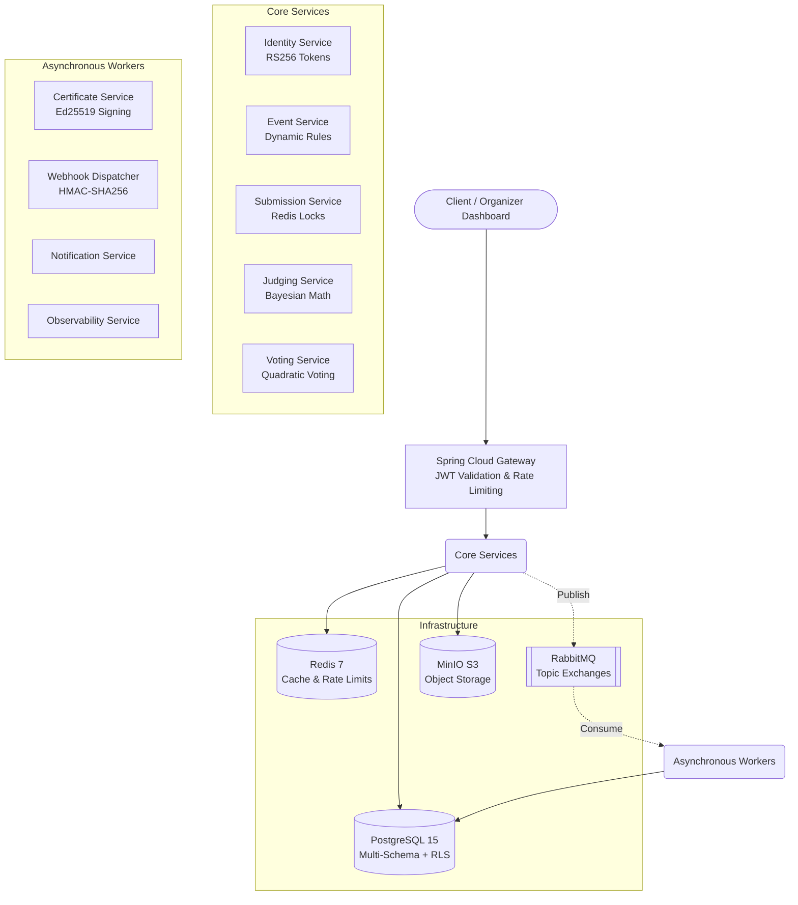
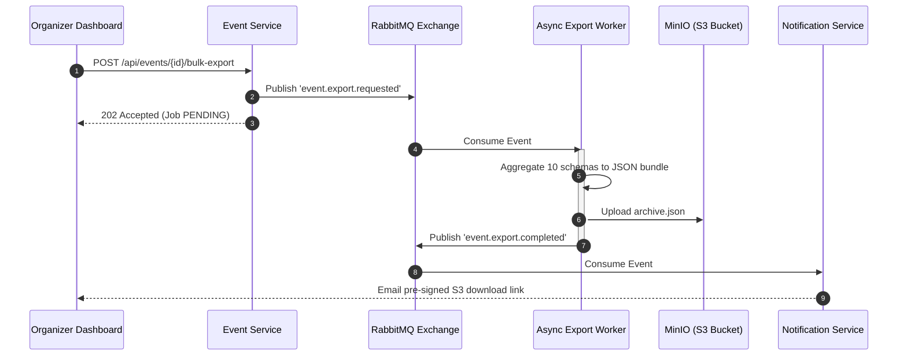

# 🚀 Dogfood: Production-Grade Hackathon Platform

Dogfood is an open-source, self-hostable hackathon submission and judging portal. We discarded the typical monolithic CRUD approach and built a highly resilient, distributed microservices architecture designed to handle massive concurrent load at deadlines without breaking a sweat.

---

## 🏛️ System Architecture

Instead of the operational overhead of Kubernetes, the platform is designed to be easily deployable via a single `docker compose up` command while retaining true microservice isolation.



---

## ⚙️ The 10-Stage Event Pipeline
We built Dogfood specifically to execute the 10 strict lifecycle stages of a professional hackathon without compromises:

1. **Registration:** Handled by `identity-service`. Issues stateless RS256 JWTs.
2. **Teams:** Invite links and team formation with backend-enforced capacity limits.
3. **Submissions:** `submission-service` uses Redis distributed locks (Redisson) to enforce absolute deadline integrity. A 12:00:00 deadline means exactly 12:00:00.
4. **Eligibility:** `event-service` evaluates dynamic JSONB rulesets (e.g., track limits, tech constraints) using the Strategy Pattern.
5. **Assignment:** `judging-service` manages disjoint batches, guaranteeing no judge ever sees a peer's ballot.
6. **Scoring:** Customizable weighted rubrics.
7. **Normalization (Core IP):** Raw scores are meaningless. We compute Z-Scores and apply **Bayesian Shrinkage** (`λ = k / (k + k0)`) to mathematically neutralize harsh, generous, and low-volume judges.
8. **Results:** Hidden by default. Public community voting utilizes **Quadratic Voting** (`n` votes = `n²` credits) to halt Sybil-like popularity contests.
9. **Certificates:** `certificate-service` mints Ed25519 cryptographically signed PDFs (Apache PDFBox) for undeniable proof of participation.
10. **Archive (Bulk Export):** `event-service` orchestrates an asynchronous RabbitMQ pipeline to export the entire hackathon payload to an S3 bucket (MinIO) for zero lock-in extraction.

---

## 📦 T4 Showcase: Asynchronous Bulk Pipeline

To prove our architecture scales, we implemented the T4 Bulk Export requirement entirely asynchronously to prevent HTTP Gateway timeouts.



---

## 🏆 Acceptance & Verification Status
The official acceptance runner (`python run.py .dogfood.toml`) verifies the platform against the strict hackathon fixture suite:
- [x] **T1 (Core):** Public gallery with fixture validation, cutoff enforcement (closed event rejects submissions), user/team models. *(Automated Suite: PASS)*
- [x] **T2 (Judging Integrity):** Per-judge Z-score normalization, Bayesian shrinkage ($k_0=5$), PostgreSQL Row-Level Security cross-judge isolation, and organizer CSV reporting. *(Automated Suite: PASS)*
- [ ] **T3 (Public Voting):** Seeded ballot shuffle, quadratic credit expenditure, and token-bucket rate limiting. *(Prototype)*
- [ ] **T4 (Stretch Capabilities):** Asynchronous bulk export workers, in-memory JGit repository commit graph forensics, and Ed25519-signed certificate generation. *(Prototype)*

---

## 📚 Architectural Deep Dives
Please read these documents; they contain the math, diagrams, and defense of our design:
1. [ARCHITECTURE.md](ARCHITECTURE.md) - Service topology and defense-in-depth Postgres RLS.
2. [JUDGING.md](JUDGING.md) - The mathematical defense of our Bayesian Shrinkage `k0=5` constant and Quadratic Voting algorithm.
3. [DATA-MODEL.md](DATA-MODEL.md) - Our Multi-Schema, single DB approach with Bulk Import/Export capabilities.

---

## 🚀 How to Run It
We have reduced a massive distributed system down to a single command. The system auto-seeds itself with a comprehensive dataset (users, scores, tracks, configurations).
```bash
docker compose up -d --build
```
The portal will be instantly available at `http://localhost:8080`.

## 🚧 What It Does Not Do Yet
While we achieved the core and stretch goals, we decided not to implement the following:
1. **Live Video Streaming/Conferencing:** For virtual judging. Integrating WebRTC natively was beyond the scope; we instead rely on submitted video URLs.
2. **Complex Multi-Event Organization Dashboards:** The platform currently assumes a single organizer context per deployment for maximum data isolation, rather than a multi-tenant SaaS model.

## 📄 License
Shipped openly under the [MIT License](LICENSE). You keep your work. We keep our word.
