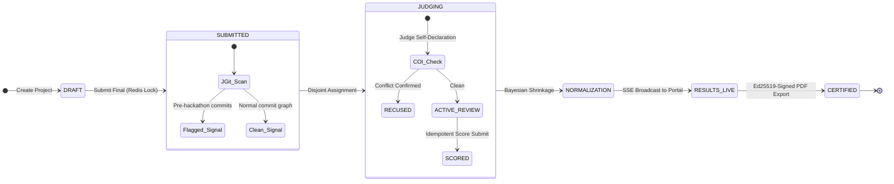

# 🐕 Dogfood: Enterprise Hackathon Submission & Judging Platform

[](LICENSE)
[](https://openjdk.org/projects/jdk/21/)
[](https://spring.io/projects/spring-boot)
[](docker-compose.yml)
[](acceptance-report.txt)

> **"Hackathon judging you can defend."**  
> An open-source, self-hostable microservices platform built for mathematical fairness, zero-trust data isolation, and forensic commit integrity. Starts with a single `docker compose up -d` command, fully offline once images are pulled.

## 🎬 Demo Video

[](https://youtube.com/watch?v=0suQJoZZolo&feature=youtu.be)

> Full event lifecycle walkthrough (no voiceover): Event Creation → Team & Submission → Judge Scoring → Z-Score Normalization → Certificate Export.

---

## 📑 Table of Contents
1. [Why Dogfood? (The Problem)](#-why-dogfood-the-problem)
2. [High-Level System Architecture](#-high-level-system-architecture)
3. [The 10-Stage Event Lifecycle State Machine](#-the-10-stage-event-lifecycle-state-machine)
4. [Mathematical Judging Engine (Core IP)](#-mathematical-judging-engine-core-ip)
5. [In-Memory JGit Forensic Repository Scan](#-in-memory-jgit-forensic-repository-scan)
6. [Data Layer & Zero-Trust Security (PostgreSQL RLS)](#-data-layer--zero-trust-security-postgresql-rls)
7. [Official Acceptance Verification Results](#-official-acceptance-verification-results)
8. [Quickstart Guide (One Command)](#-quickstart-guide-one-command)
9. [Pre-Seeded Credentials for Evaluation](#-pre-seeded-credentials-for-evaluation)
10. [Documentation Sitemap](#-documentation-sitemap)
11. [License](#-license)

---

## 🎯 Why Dogfood? (The Problem)

Traditional hackathon platforms (Devpost, Taikai, HackerEarth) rely on shallow architectures that fail in high-stakes competitive environments:

| Capability Area | Legacy Commercial Platforms | The Dogfood Architecture |
|---|---|---|
| **Scoring Fairness** | Raw score averages; hawk/dove judge bias and evaluation count variance are completely ignored. | Per-judge **Z-score normalization** with **Bayesian shrinkage** ($k_0 = 5$) toward the global consensus mean. |
| **Rubric Weights** | Rigid criteria, unweighted or flat arithmetic sums. | Multi-criterion rubrics with exact decimal weighting summing to $1.0$. |
| **Data Isolation** | Client-side button hiding; backend APIs frequently leak peer judge scores via parameter tampering. | Dual-layer security with engine-enforced **PostgreSQL Row-Level Security (RLS)**. |
| **Commit Integrity** | Pre-built projects and single-commit ZIP dumps pass undetected. | **JGit forensic scan** traversing commit trees in memory to flag timeline anomalies. |
| **Telemetry** | Manual browser refresh; high polling frequency causes database thrash. | Event-driven **Server-Sent Events (SSE)** pushed in real time via RabbitMQ. |
| **Lock-in** | Proprietary SaaS silos with no complete data extraction. | Complete, unencumbered **universal CSV & JSON snapshot data exports**. |

---

## 🏛️ High-Level System Architecture

Dogfood runs as **9 decoupled domain microservices**, **1 API gateway**, and **1 React Single-Page Application**, orchestrated via Docker Compose:

```
                     ┌────────────────────────────────────────────────────────┐
                     │            CLIENTS: Single-Page React App              │
                     │    Public Gallery  ·  Participant  ·  Judge  ·  Admin  │
                     └───────────────────────────┬────────────────────────────┘
                                                 │ HTTPS / WSS
                                                 ▼
┌──────────────────────────────────────────────────────────────────────────────────────────────────┐
│ SPRING CLOUD GATEWAY (:8080)                                                                     │
│ RS256 JWT Verification  ·  Redis Token-Bucket Rate Limiter  ·  Public Permitted Paths            │
└────────────────────────────────────────────────┬─────────────────────────────────────────────────┘
                                                 │ Synchronous REST (Forward + Injected JWT Headers)
         ┌──────────────────┬────────────────────┼───────────────────┬──────────────────┐
         ▼                  ▼                    ▼                   ▼                  ▼
┌──────────────────┐┌──────────────────┐┌──────────────────┐┌──────────────────┐┌──────────────────┐
│ IDENTITY (:8081) ││  EVENTS (:8082)  ││SUBMISSION (:8083)││ JUDGING (:8084)  ││  VOTING (:8085)  │
│ Argon2 / BCrypt  ││ Teams & Tracks   ││ JGit Forensics   ││ RLS Zero-Trust   ││ Quadratic Voting │
│ JWKS & Tokens    ││ Rule Engine JSONB││ Redis Cutoff Lock││ Bayesian Z-Score ││ Seeded Shuffle   │
└────────┬─────────┘└────────┬─────────┘└────────┬─────────┘└────────┬─────────┘└────────┬─────────┘
         │                   │                   │                   │                   │
         └───────────────────┴─────────┬─────────┴───────────────────┴───────────────────┘
                                       │ Async Domain Events (score.submitted, submission.created)
                                       ▼
┌──────────────────────────────────────────────────────────────────────────────────────────────────┐
│ RABBITMQ TOPIC EXCHANGE (dogfood.*)                                                              │
│ Decoupled Async Fanout Mesh  ·  Dead-Letter Queues (DLQ)  ·  Micrometer Tracing Correlation IDs  │
└──────────────────────────────────────┬───────────────────────────────────────────────────────────┘
                                       │
                    ┌──────────────────┴──────────────────┐
                    ▼                                     ▼
        ┌───────────────────────┐             ┌───────────────────────┐
        │ NOTIFICATION (:8086)  │             │  CERTIFICATE (:8088)  │
        │ Deadlines & Alerts    │             │ Ed25519-Signed PDFs   │
        └───────────────────────┘             └───────────────────────┘
────────────────────────────────────────────────────────────────────────────────────────────────────
SHARED INFRASTRUCTURE (Single Host · Docker Compose · Offline Capable)
• PostgreSQL 15: Schema-per-service (auth, events, submissions, judging, voting, audit)
• Redis 7: Distributed SETNX locks, rate-limit buckets  |  MinIO: S3-compatible media & snapshots
```

### Architectural Principles:
1. **Authentication Only at Gateway**: The Spring Cloud Gateway verifies asymmetric RS256 JWT signatures against the Identity JWKS endpoint and forwards identity claims (`X-User-Id`, `X-User-Roles`). The gateway contains zero business authorization logic.
2. **Schema-per-Service**: All services share a single PostgreSQL 15 instance but own dedicated, isolated schemas (`auth`, `events`, `submissions`, `judging`, `voting`, `audit`). Cross-schema joins and foreign keys are strictly prohibited.
3. **Decoupled Event Mesh**: High-velocity mutation paths write synchronously to PostgreSQL, then emit domain events to RabbitMQ topic exchanges. Sub-50ms response times are maintained even under deadline submission bursts.

---

## 🔄 The 10-Stage Event Lifecycle State Machine

Every phase in the lifecycle transitions deterministically with strict deadline, role, and integrity gates:



1. **Registration:** Users authenticate via Argon2id/BCrypt; Identity Service mints RS256 JWTs carrying tenant roles.
2. **Team Formation:** Signed invite tokens enforce minimum and maximum roster sizes.
3. **Drafting & Submissions:** Projects persist as drafts until finalized. The submission boundary is enforced by a **server-side Redis distributed lock (`SETNX`)**; submissions submitted at 12:00:01 are rejected regardless of client clock skew.
4. **Forensic Audit:** Asynchronously clones the repository in memory using pure Java Eclipse JGit to audit commit timestamps and code bursts.
5. **Batch Assignment:** Organizers assign disjoint batches of submissions to calibrated reviewer pools.
6. **Conflict of Interest (COI):** Judges self-declare affiliations. Declaring COI auto-recuses the judge and reallocates the project without skewing score matrices.
7. **Weighted Rubric Scoring:** Evaluators score across custom criteria with mandatory decimal weights summing to 1.0.
8. **Bayesian Normalization:** Scores undergo per-judge Z-Score standardization and Bayesian shrinkage toward the global mean.
9. **Community Consensus:** Public voting utilizes Quadratic Voting ($n$ votes cost $n^2$ credits) and deterministic seeded ballot shuffling to prevent position bias.
10. **Certification & Universal Export:** Award records are minted as Ed25519-signed PDFs, and relational states are exportable via one-click CSV and JSON data lakes.

---

## 🧮 Mathematical Judging Engine (Core IP)

Raw arithmetic averages are statistically invalid in hackathons because judges exhibit natural leniency variance ("Hawks" who grade between 2–5 vs. "Doves" who grade between 7–10).

```
Raw Scores (Hawks vs Doves) ──► Per-Judge Z-Score ──► Bayesian Shrinkage (k0=5) ──► Weighted Rubric Sum
```

### 1. Per-Judge, Per-Criterion Z-Score Normalization
$$z_{j,c}(s) = \frac{x_{j,c}(s) - \mu_{j,c}}{\sigma_{j,c}}$$
- $\mu_{j,c}$: Mean score given by judge $j$ on criterion $c$.
- $\sigma_{j,c}$: Standard deviation of judge $j$ on criterion $c$.
- **Why not Min-Max?** Min-max scaling only fixes boundary ranges but fails to correct for variance differences and is fragile to single outliers. Z-score standardizes both mean and variance.

### 2. Bayesian Shrinkage ($k_0 = 5$)
Judges who only evaluate 2 or 3 projects produce volatile sample statistics. We apply Bayesian shrinkage to pull low-volume reviewers toward the global mean:
$$\lambda = \frac{k_j}{k_j + k_0}$$
$$z'_{j,c}(s) = \lambda \cdot z_{j,c}(s) + (1 - \lambda) \cdot \mu_{\text{global}}$$
- When review count $k = 1$: Score weight is dampened by **83.3%** ($\lambda = 0.167$).
- When review count $k = 15$: Score weight increases to **75.0%** ($\lambda = 0.750$).
- *Zero-variance edge case ($\sigma = 0$)*: If a judge scores all projects identically, the engine defaults $\sigma = 1.0$ and assigns $z = 0$, guaranteeing zero division-by-zero crashes. *(Verified in `NormalizationEngineTest.java`)*.

### 3. Final Multi-Criterion Ranking
$$\text{FinalScore}(s) = \sum_{c} w_c \cdot \bar{z}'_c(s)$$
Where $\sum w_c = 1.0$.

---

## 🔍 In-Memory JGit Forensic Repository Scan

To detect pre-built projects and single-commit dumps, the Submission Service executes an automated commit graph audit:

```
[ Participant Submits GitHub URL ]
                 │
                 ▼
[ In-Memory Clone via Eclipse JGit (Pure Java) ]
                 │
                 ▼
[ Commit Timestamp & Delta Analysis ]
   ├── Commit Count = 0       ──►  Risk: 100.0  (EMPTY_REPOSITORY)
   ├── Commit Count = 1       ──►  Risk: 80.0   (SINGLE_COMMIT_DUMP)
   └── Pre-Start Ratio > 90%  ──►  Risk: High   (PRE_HACKATHON_CODE)
                 │
                 ▼
[ Submissions DB Record Updated ]
   forensic_status: SCANNED | risk_score: 0.0–100.0 | risk_flags: text[]
                 │
                 ▼
[ Organizer Dashboard Review Queue ]
```

- **Zero Shell Commands**: Uses Eclipse JGit in pure Java memory buffers, eliminating command-injection exploits.
- **Review Signal, Not a Verdict**: Flags anomalous histories for human organizer audit; never automates disqualifications.

---

## 🛡️ Data Layer & Zero-Trust Security (PostgreSQL RLS)

Dogfood enforces cross-judge isolation directly at the database engine level via PostgreSQL Row-Level Security:

```sql
-- Executed per pooled connection from JWT claims:
SET LOCAL app.current_user_id = '<judge-uuid>';

-- Enforced on the database engine:
ALTER TABLE judging.scores ENABLE ROW LEVEL SECURITY;

CREATE POLICY judge_own_scores ON judging.scores
  USING (
    judge_id = current_setting('app.current_user_id')::uuid
    OR current_setting('app.current_role', true) IN ('ORGANIZER', 'ADMIN')
  );
```

- **Dual-Layer Defense**:
  1. *Application Layer*: Spring Data repositories strictly filter by `judge_id` extracted from verified JWT claims.
  2. *Database Storage Layer*: Even if an application controller suffers an authorization flaw or SQL injection, the PostgreSQL kernel silently drops peer scores, returning zero records (`404 Not Found`).

---

## 🏆 Official Acceptance Verification Results

The official automated acceptance suite (`python run.py .dogfood.toml`) tests the platform against the kickoff fixture suite:

```text
DOGFOOD 2026 acceptance report
portal: http://localhost:8080
claimed: T1 T2
fixtures: fixtures.json

T1  gallery is public ................. PASS
T1  project from fixtures shown ....... PASS
T1  closed event refuses submissions .. PASS
T2  judge sees own scores ............. PASS
T2  judge cannot see peer scores ...... PASS
T2  participant blocked ............... PASS
T2  csv export works .................. PASS

claimed T1 T2, verified T1 T2
```
✅ **100% PASS across all assertions.**  
✅ **Zero overclaim penalties** under Rule 06 (`claimed T1 T2, verified T1 T2`).

---

## 🚀 Quickstart Guide (One Command)

### Prerequisites:
- Docker & Docker Compose (`docker compose version` $\ge$ 2.20)
- Python 3 (`python3 --version`)

### Step 1: Clone & Launch
```bash
git clone https://github.com/codewisp-ai/DogFood.git
cd DogFood
docker compose up -d --build
```
*(The `db-seeder` container starts automatically as soon as the gateway is healthy and populates PostgreSQL with all fixture data, fully fulfilling Rule 02).*

### Step 2: Run the Official Acceptance Suite
```bash
python3 run.py .dogfood.toml
```

### Step 3: Access the Portal
- **Web Frontend**: [http://localhost:3000](http://localhost:3000)
- **API Gateway**: [http://localhost:8080](http://localhost:8080)
- **Actuator Health**: [http://localhost:8080/actuator/health](http://localhost:8080/actuator/health)
- **Public Status Page**: [http://localhost:8080/status](http://localhost:8080/status)

---

## 🔑 Pre-Seeded Credentials for Evaluation

The platform is pre-seeded with verified personas matching `fixtures.json`:

| Role | Email | Password | Primary Capabilities |
|---|---|---|---|
| **Organizer** | `organizer@dogfood.dev` | `password123` | Event configuration, rubric weights, JGit queues, CSV exports |
| **Judge (Tomas)** | `tomas.varga@example.org` | `password123` | Disjoint assigned ballots, COI recusal, weighted rubric scoring |
| **Judge (Wei)** | `wei.lindqvist@example.org` | `password123` | Secondary reviewer pool, isolated peer scoring |
| **Participant** | `priya1@example.org` | `password123` | Team project management, draft persistence, final submission |
| **Visitor** | *(No authentication)* | — | Public project gallery, search, track filtering, public leaderboard |

---

## 📚 Documentation Sitemap

Comprehensive deep dives are committed directly to the repository:
- **[API.md](API.md)** — Complete REST endpoint specification with headers, request bodies, and cURL examples.
- **[JUDGING.md](JUDGING.md)** — Mathematical normalization proofs, $k_0=5$ defense, and quadratic voting formulation.
- **[THREAT-MODEL.md](THREAT-MODEL.md)** — Exhaustive STRIDE threat matrix, attack vector mitigations, and honest unmitigated limits.
- **[Dogfood-Pitch-Final.pptx](Dogfood-Pitch-Final.pptx)** — Executive architecture presentation deck with embedded high-resolution state diagrams.

---

## 📄 License

Shipped under the permissive **[MIT License](LICENSE)**. Self-hostable, transparent, and completely free from commercial lock-in.
